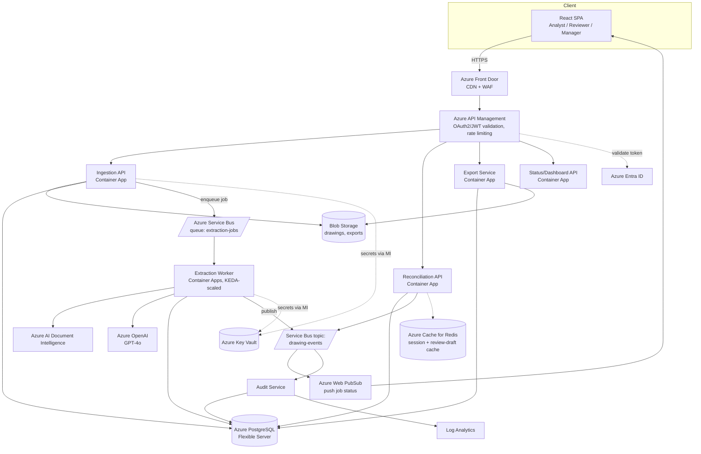
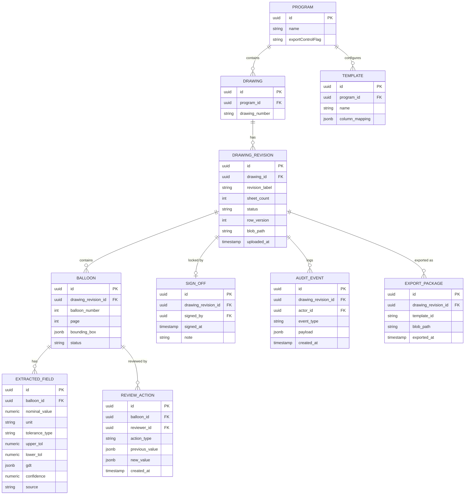

# Ballooned Drawing Extraction — Production Architecture

**Software Architecture & Design Specification — Full System**
Doc No. BDX-ARCH-FULL-001 · Rev A — Draft · Date 2026-08-26

Implements the complete requirement set in [ballooned-drawing-requirements.md](ballooned-drawing-requirements.md), including the reconciliation/sign-off gate (§10), auth and segregation of duties (§9), and the NFR targets in §8 (100-balloon drawing < 2 min, 200-drawing batch, 99.5% availability). Builds on validated assumptions from the [POC](architecture-poc.md) — this is not the POC hardened, it is a redesign informed by what the POC proved about the extraction pipeline.

**Environment assumptions (confirmed):** Commercial Azure; single-tenant internal deployment (one organization) — no cross-tenant isolation required; Azure Entra ID as the identity provider. **Still open** (see requirements §14): deployment region/data residency specifics, exact Excel template variants, and target drawing volume — this design uses the NFR targets already stated in the requirements doc (§8) and calls out where a firm volume number would change a sizing decision.

---

## 1. High-Level Design (HLD)

### 1.1 System Architecture Overview

**Pattern: event-driven microservices**, split along a genuine operational fault line: **AI-bound, bursty, latency-variable work** (balloon detection, extraction) versus **human-paced, steady, consistency-critical work** (review, reconciliation, sign-off). Services communicate synchronously via REST (through Azure API Management) for anything a client waits on, and asynchronously via Azure Service Bus for the extraction pipeline, which can take anywhere from seconds to minutes per drawing and must not block the caller or the review UI.

Bounded contexts / services:

| Service | Owns |
|---|---|
| **Ingestion API** | Upload, file validation, drawing/revision metadata, versioning |
| **Extraction Worker** | Balloon detection + field extraction (Document Intelligence + Azure OpenAI), runs off the queue |
| **Reconciliation API** | Review sessions, discrepancy logging, sign-off, segregation-of-duties enforcement |
| **Export Service** | Template-driven Excel generation, batch packaging |
| **Audit & Notification Service** | Immutable audit log, job-status push notifications |

### 1.2 Component Diagram



**External dependencies:** Azure Entra ID (auth), Azure AI Document Intelligence, Azure OpenAI, Azure Service Bus, Azure Web PubSub (real-time status), Azure Key Vault (secrets via managed identity — no credentials in app config), Azure Monitor / Log Analytics / Application Insights (observability).

### 1.3 Data Flow — "Drawing from upload to signed-off export"

1. **Analyst uploads** a drawing (or a batch) via the SPA → Front Door → APIM (JWT validated, `Analyst` role required) → **Ingestion API**.
2. Ingestion API validates file type/quality (FR-03), extracts title-block metadata via Document Intelligence (FR-02), creates a `Drawing` + `DrawingRevision` row in Postgres (`status=Uploaded`), stores the file in Blob, and enqueues an `extraction-jobs` message (`drawingRevisionId`).
3. **Extraction Worker** (auto-scaled by Service Bus queue depth via KEDA) dequeues the job, runs balloon detection (Document Intelligence layout) and field extraction (Azure OpenAI structured output) exactly as validated in the POC, then writes `Balloon` + `ExtractedField` rows to Postgres per balloon, each with a confidence score. Status moves to `Extracted`. An event is published to the `drawing-events` topic.
4. **Notification** fan-out: Audit Service records the event; Web PubSub pushes a "ready for review" update to any connected SPA session watching that drawing.
5. **Analyst review**: the Reconciliation API serves the side-by-side drawing/data view (FR-21); low-confidence balloons are pre-sorted first (FR-14 acceptance criterion). Each confirm/correct action is written through to Postgres (and cached in Redis for the active session to keep the UI responsive on re-render).
6. **Independent reconciliation**: a second reviewer (enforced ≠ analyst, FR-22/segregation of duties) repeats the pass. Any value mismatch is logged with both identities (FR-23) and the balloon stays `Unresolved` until explicitly resolved.
7. Once **100% of balloons are `Reconciled`** (FR-24, gate), the reviewer may **sign off** (FR-26): Reconciliation API writes a `SignOff` row and flips `DrawingRevision.status=SignedOff` inside one Postgres transaction, then publishes `DrawingSignedOff` via the **outbox pattern** (§2.2) so the event is guaranteed to fire iff the transaction committed.
8. **Export**: Export Service, triggered by `DrawingSignedOff` or an explicit user request, resolves the configured template (FR-17), reads the locked reconciled record from Postgres, generates the `.xlsx`, stores it in Blob, and records an `ExportPackage` row. The API refuses export for any revision not `SignedOff` (FR-18, returns `409`).
9. Every step from 2–8 writes an `AuditEvent` (actor, action, timestamp, before/after where applicable) — the audit trail is append-only and never mutated (FR-27).

### 1.4 Architectural Trade-offs

| # | Decision | Chosen because | Sacrificed |
|---|---|---|---|
| 1 | **Async (Service Bus) extraction pipeline, not synchronous request/response** | Extraction latency is inherently variable (Document Intelligence + LLM calls, retries) and the batch NFR (200 drawings/package, §8) would either need very long HTTP timeouts or a queue. A queue also gives natural backpressure and per-drawing retry isolation — one bad drawing can't take down a batch. | Immediate response — the client must poll/subscribe (Web PubSub) for completion instead of getting a result inline, adding a moving part (real-time channel) the POC didn't need. |
| 2 | **Microservices split on the AI-bound/human-paced fault line, not a single service** | Extraction Worker load is bursty and CPU/IO-light-but-latency-heavy (mostly waiting on Azure AI calls) — it wants to scale to zero between batches and burst wide during one. Reconciliation API load is steady, low-volume, human click-driven. Scaling them together wastes cost either direction. | Operational simplicity: this now needs API Management, service-to-service auth, distributed tracing, and a shared schema-ownership discipline across services — real cost for a single-tenant internal tool, accepted because the volumes and batch-processing requirement justify it. |
| 3 | **Strong consistency (Postgres, ACID transactions) for reconciliation/sign-off state, not an eventually-consistent store** | Sign-off is the compliance-critical gate (§2 "100% reconciliation," §9 segregation of duties): two reviewers must never both be able to sign off the same revision, a balloon must never be silently double-counted as reviewed. This needs transactional guarantees, not eventual consistency. | Some write throughput ceiling under heavy concurrent review load — judged acceptable, since review is human-paced (one reviewer acting on one balloon at a time) and the NFR (§8) doesn't demand high write concurrency here; connection pooling (PgBouncer) is the standard mitigation if it becomes real. |
| 4 | **LLM-based structured extraction (Azure OpenAI) over deterministic rule-based parsing, with Document Intelligence as grounding** | Dimension/tolerance/GD&T notation varies too much across drawing standards and eras for a hand-written parser to generalize; an LLM given the DI text layer + image handles notation variance the POC validated. | Determinism and full explainability of every extracted value — mitigated, not eliminated, by per-field confidence scores (FR-14) and the mandatory human reconciliation gate (FR-22) that this architecture never allows to be bypassed. |

---

## 2. Low-Level Design (LLD)

### 2.1 Core Modules & Classes (by service)

**Ingestion API**
- `DrawingUploadController` — accepts multipart/batch uploads, delegates to `FileValidator`.
- `FileValidator` — type/size/DPI checks (FR-03); rejects with itemized reasons.
- `TitleBlockExtractor` — Document Intelligence call scoped to the title-block region; feeds `RevisionManager`.
- `RevisionManager` — enforces FR-04: a new revision creates a new linked `DrawingRevision`, never overwrites a reconciled one.
- `ExtractionJobPublisher` — writes the Service Bus message; wraps the DB insert + enqueue in the **outbox pattern** (§2.2).

**Extraction Worker**
- `ExtractionOrchestrator` — same responsibility as the POC's, now consuming from a queue and writing to Postgres instead of returning inline JSON.
- `BalloonDetector`, `ToleranceNormalizer`, `GdtParser` — carried forward from the POC design, now unit-testable services with dependency-injected Azure clients.
- `ConfidenceScorer` — assigns and persists per-field confidence; drives the review UI's sort order (FR-14).
- `ExtractionCircuitBreaker` — see §2.2.

**Reconciliation API**
- `ReviewSessionService` — serves the side-by-side view payload (drawing SAS URL + balloon list).
- `BalloonReviewHandler` — processes one confirm/correct action; writes `ReviewAction`, updates `Balloon.status`.
- `DiscrepancyLogger` — implements FR-23: on value mismatch, persists both values + both identities, sets `Unresolved`.
- `SegregationOfDutiesGuard` — blocks a sign-off/review action where `reviewerId == analystId` for that balloon (FR-22, security §9); returns `403`.
- `SignOffService` — validates 100%-reconciled precondition (FR-24) inside the same transaction as the status flip, then triggers the outbox event.

**Export Service**
- `TemplateResolver` — loads the configured column-mapping definition (FR-17) by `programId`/`customerId`.
- `ExcelGenerator` — renders the locked record into the template.
- `PackageBundler` — batch export, one workbook or one file per drawing (FR-20).

**Audit & Notification Service**
- `AuditEventConsumer` — subscribes to `drawing-events`, writes append-only `AuditEvent` rows (FR-27).
- `NotificationDispatcher` — pushes status changes to Web PubSub groups keyed by `drawingRevisionId`.

### 2.2 Design Patterns

| Pattern | Where | Why |
|---|---|---|
| **Saga / explicit state machine** | `DrawingRevision.status`: `Uploaded → Extracted → UnderReview → Reconciled → SignedOff → Exported`, plus terminal `ExtractionFailed`/`Stale` | Makes every legal transition explicit and testable; illegal transitions (e.g., export from `UnderReview`) are rejected at the domain layer, not just the API layer. |
| **Outbox pattern** | Ingestion API (job enqueue), Reconciliation API (sign-off event) | Guarantees a Postgres write and its corresponding Service Bus message are never inconsistent (message published without commit, or vice versa) — a background relay reads an `outbox` table in the same transaction and publishes at-least-once. |
| **Circuit breaker** (Polly / equivalent) | Extraction Worker's calls to Document Intelligence and Azure OpenAI | After N consecutive failures, opens and fails fast with `ExtractionUnavailable` rather than piling up retries against a degraded upstream; jobs fall back to a "manual entry required" state instead of blocking the queue. |
| **Retry with exponential backoff + jitter** | All outbound Azure SDK calls (Document Intelligence, Azure OpenAI, Service Bus send) | Standard mitigation for Azure API throttling (429) and transient 5xx. |
| **Strategy pattern** | `IExtractionStrategy` (carried from POC) | Allows a text-only vs. vision-grounded vs. future custom-model strategy to be selected per drawing-quality tier without touching the orchestrator. |
| **Repository pattern** | Data access in every service | Isolates Postgres/EF Core (or equivalent) specifics from domain logic; makes unit testing without a live database practical. |
| **CQRS-lite** | `Status/Dashboard API` reads from a denormalized read model (materialized view or a dedicated reporting table refreshed on `drawing-events`), while writes go through Reconciliation/Ingestion APIs | Keeps dashboard/batch-status queries (FR-28, FR-29) from competing with, or being blocked by, the transactional review write path. |
| **Idempotency keys** | `POST /drawings` and `POST /drawings/{id}/export` | Client-supplied idempotency key lets a retried upload/export request (network blip, double-click) be safely deduplicated instead of creating a duplicate revision or export. |

### 2.3 Error Handling & Edge Cases

Directly extends requirements §12; only the technical mechanism is new here.

| Condition | Handling |
|---|---|
| Document Intelligence / Azure OpenAI outage | Circuit breaker opens; job marked `ExtractionFailed` with reason; drawing is still fully usable via **manual entry** in the Reconciliation UI — the human path never depends on the AI path being up. |
| Malformed/non-schema LLM output | One repair re-prompt; on second failure, field persisted with `confidence=0` and `extractionError` — never silently dropped (same rule as POC). |
| Duplicate balloon numbers detected | `BalloonDetector` flags at write time; `Drawing.status` cannot advance past `Extracted` until resolved (FR-08) — enforced by the state machine, not just a UI warning. |
| Two reviewers attempt to sign off concurrently | Optimistic concurrency: `DrawingRevision` carries a `rowVersion`; second concurrent sign-off attempt gets `409 Conflict` and must refresh. |
| Reviewer account equals analyst account | `SegregationOfDutiesGuard` rejects with `403` and an explicit reason (FR-22, §9) — checked server-side on every review/sign-off call, never trusted from the client. |
| Revision superseded mid-reconciliation | `RevisionManager` marks the in-progress revision's session `Stale` (FR-04's edge case) rather than merging; reviewer is redirected to the new revision. |
| Export requested before sign-off | Rejected at the domain layer with `409` and the list of still-open balloon IDs (FR-18), regardless of which client/path calls it — no UI-only gate. |
| Poison message in `extraction-jobs` queue | After max delivery count, Service Bus dead-letters it automatically; a scheduled job alerts on non-empty DLQ rather than the message being silently lost. |
| Upload interrupted / corrupted file | Server-side checksum validation post-transfer before the job is enqueued; failure returns a specific, actionable `422`. |

---

## 3. API Specification

### 3.1 Interface Protocols

- **REST over HTTPS, via Azure API Management**, for everything the SPA calls directly (Ingestion, Reconciliation, Export, Status APIs). Chosen over GraphQL because the client's data needs are fixed and resource-shaped (a drawing, its balloons, a review action) rather than ad-hoc/composable — GraphQL's flexibility would be unused complexity here. Chosen over gRPC for these external endpoints because the client is a browser SPA and REST/JSON keeps tooling (APIM policies, browser debugging, Postman-based QA) simple.
- **Azure Service Bus (async messaging)** for Ingestion → Extraction Worker and for the `drawing-events` fan-out — this is a queue/topic, not a request/response protocol, chosen specifically for the decoupling discussed in HLD trade-off #1.
- **Azure Web PubSub (WebSockets)** for pushing job-status/review-state changes to the SPA in real time, avoiding client polling.

### 3.2 Endpoint Definitions

#### `POST /api/v1/drawings`

Uploads a new drawing (or batch) and starts async processing.

- **Auth:** Bearer JWT, role `Analyst` or `Manager`.
- **Request:** `multipart/form-data`
  | Field | Type | Notes |
  |---|---|---|
  | `file` | binary | required |
  | `drawingNumber` | string | optional override; else parsed from title block |
  | `programId` | string (uuid) | required — scopes access and template selection |
  | `idempotencyKey` | header `Idempotency-Key` | required |

- **Response `202 Accepted`:**
```json
{
  "drawingRevisionId": "7c1a...-uuid",
  "drawingNumber": "DWG-10245",
  "revision": "C",
  "status": "Uploaded",
  "statusUrl": "/api/v1/drawings/7c1a...-uuid",
  "realtimeChannel": "wss://bdx.webpubsub.azure.com/client/hubs/drawing-status?group=7c1a..."
}
```
- **Status codes:** `202` accepted for processing · `400` malformed request · `409` idempotency key reused with different payload · `422` file quality below threshold · `413` file too large.

#### `POST /api/v1/drawings/{drawingRevisionId}/signoff`

Reviewer signs off a fully reconciled revision, locking it.

- **Auth:** Bearer JWT, role `Reviewer`; **must not** equal the analyst who performed the extraction confirmation on any balloon in this revision.
- **Request:**
```json
{ "note": "Reconciled against Rev C, all 47 characteristics confirmed." }
```
- **Response `200 OK`:**
```json
{
  "drawingRevisionId": "7c1a...-uuid",
  "status": "SignedOff",
  "signedBy": "reviewer@satincorp.com",
  "signedAt": "2026-08-26T14:32:10Z",
  "rowVersion": 4
}
```
- **Response `409 Conflict`** (not all balloons reconciled):
```json
{
  "error": "IncompleteReconciliation",
  "message": "12 of 47 balloons are not yet reconciled.",
  "openBalloonIds": ["b-0007", "b-0012", "..."]
}
```
- **Response `403 Forbidden`** (segregation of duties):
```json
{ "error": "SegregationOfDutiesViolation", "message": "Signer must differ from the analyst who confirmed one or more balloons on this revision." }
```
- **Status codes:** `200` signed off · `403` segregation-of-duties violation · `404` unknown revision · `409` incomplete reconciliation or concurrent sign-off.

*(Additional endpoints — `GET /drawings/{id}`, `POST /drawings/{id}/balloons/{balloonId}/review`, `POST /drawings/{id}/export`, `GET /packages/{id}/status` — follow the same contract conventions and are enumerated in the OpenAPI spec to be generated from this document; omitted here for brevity per the "at least 2 primary endpoints" requirement.)*

### 3.3 Authentication & Authorization

- **Identity provider:** Azure Entra ID. SPA authenticates via **OAuth 2.0 Authorization Code + PKCE**; service-to-service calls (Reconciliation → Export, etc.) use **managed identity + client-credentials** — no shared secrets in app config, all secrets/certs resolved through Azure Key Vault.
- **MFA:** enforced at the Entra ID Conditional Access layer, not application code (matches security §9).
- **Authorization:** Entra ID App Roles (`Analyst`, `Reviewer`, `Manager`, `Admin`) issued as JWT claims; **API Management validates the token** (issuer, audience, expiry) at the edge, and **each service independently re-checks role + business-rule authorization** (e.g., segregation of duties) — defense in depth, per security requirement "enforced at the API layer, not just the UI."
- **Scoping:** every request is additionally scoped to `programId`; a user's Entra ID group membership maps to allowed programs, checked on every read/write (relevant if this ever grows into the multi-tenant model the requirements doc flags as an open question).

---

## 4. Data Specification

### 4.1 Entity-Relationship Overview



### 4.2 Data Storage Choices

| Store | Used for | Justification |
|---|---|---|
| **Azure Database for PostgreSQL – Flexible Server** | All relational entities above | ACID transactions are non-negotiable for the sign-off gate (HLD trade-off #3); mature row-level locking supports the optimistic-concurrency pattern in §2.3; rich SQL supports the dashboard/reporting needs of FR-28/FR-29 without a separate analytics store at this scale. |
| **Azure Blob Storage** | Source drawing files, generated Excel exports | Large binary objects; Postgres should never hold file bytes. Hot/Cool/Archive tiering maps directly onto the lifecycle policy in §4.3. |
| **Azure Cache for Redis** | Active review-session draft state, APIM rate-limit counters | Review-in-progress edits are cached and written through to Postgres on save/navigate-away, keeping the side-by-side UI (FR-21) responsive without hitting Postgres on every keystroke; TTL'd, never the system of record. |
| **Azure Service Bus** | `extraction-jobs` queue, `drawing-events` topic | Durable, ordered-enough, dead-letter-capable messaging fit for the async pipeline in HLD §1.3 — not a data store, called out here because it sits on the data path. |

### 4.3 Caching & Lifecycle Strategy

- **Cache invalidation:** Redis review-draft entries are invalidated on explicit save (write-through to Postgres) and on a sliding TTL (default 30 min of inactivity) to avoid stale drafts surviving an abandoned session; dashboard read-model entries are invalidated by the `drawing-events` topic consumer, not by TTL, so status views are event-fresh rather than eventually-fresh-on-a-timer.
- **Blob lifecycle:** Hot tier while a `DrawingRevision` is active (pre-`SignedOff`); moved to **Cool** 90 days after `SignedOff`; moved to **Archive** at 1 year, retained per the applicable compliance/contractual retention period (ties to requirements NFR "Compliance," §8, and security "Data retention & deletion," §9) — exact periods are program-configurable, not hard-coded, since AS9102/PPAP retention requirements vary by customer contract.
- **Deletion:** application-level delete is always **soft** (`DrawingRevision.status=Deleted`, blob access revoked); hard deletion is a separate, audited compliance workflow that removes blob content and PII while preserving a tombstone `AuditEvent` recording that a deletion occurred, who requested it, and why — satisfying the audit requirement without contradicting a legitimate erasure request.
- **Audit log retention:** `AuditEvent` rows are never deleted by the application; retention/purge, if ever required, is a DBA-executed, separately governed process outside normal application code paths.

---

## 5. Non-Functional Sizing Notes (ties to requirements §8)

| Target | Design implication |
|---|---|
| 100-balloon drawing < 2 min end-to-end | Extraction Worker parallelizes per-page Document Intelligence calls; Azure OpenAI calls batched per-page (not per-balloon) to stay within the budget. |
| 200 drawings/package without degradation | KEDA-scaled Extraction Worker pool scales out on `extraction-jobs` queue depth; Ingestion API accepts the whole batch immediately (`202` per file) rather than blocking on processing. |
| 99.5% uptime, no data loss on transient restart | Service Bus provides at-least-once delivery across worker restarts; Postgres writes are the only source of truth for state, so a worker crash mid-job simply leaves the message unacked for redelivery. |
| WCAG 2.1 AA review UI | SPA concern, not backend architecture — noted here only as a dependency the frontend team owns against this API contract. |

---

## 6. What Changes If a Firm Answer Arrives on the Open Questions

- **Multi-tenant SaaS instead of single-tenant:** `Program` becomes tenant-scoped with row-level security in Postgres; Entra ID single-tenant app registration becomes multi-tenant or B2B; Blob containers gain a tenant prefix and per-tenant SAS scoping.
- **Azure Government required for ITAR-flagged programs:** Document Intelligence and Azure OpenAI model/region availability narrows substantially — this would likely require a hybrid design (Gov boundary for controlled programs, Commercial for the rest) rather than a single deployment, and is worth a dedicated spike before committing.
- **Native CAD input in scope:** adds a new Ingestion path (CAD parser service) upstream of the existing pipeline; does not change the Extraction Worker → Reconciliation → Export chain.
