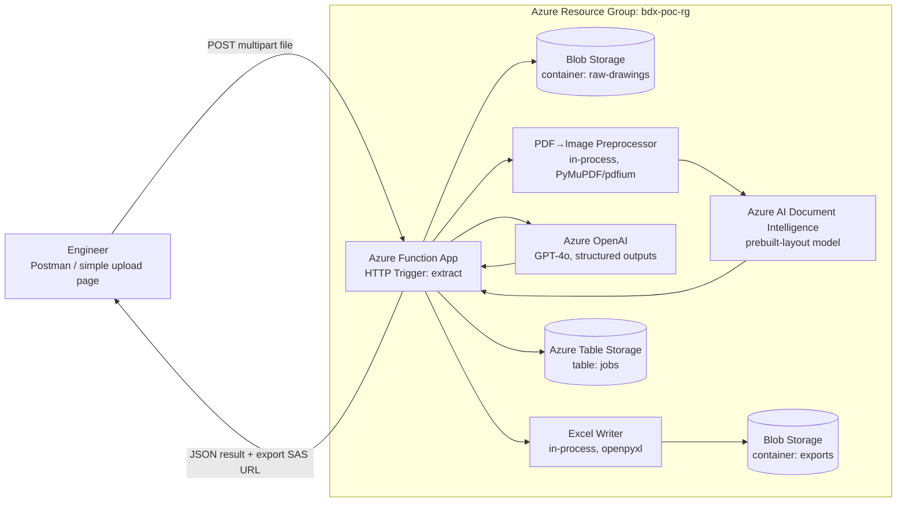

# Ballooned Drawing Extraction — POC Architecture

**Software Architecture & Design Specification — Proof of Concept**
Doc No. BDX-ARCH-POC-001 · Rev A — Draft · Date 2026-08-26

**Scope of this POC:** validate the single riskiest technical assumption behind the whole product — that Azure Document Intelligence + Azure OpenAI can reliably read balloon numbers, nominal dimensions, tolerances, and GD&T frames off real ballooned drawings — before investing in the full gated workflow. **No auth, no second-reviewer reconciliation gate, no multi-user concerns, single drawing at a time.** These are deliberately deferred to the [Full production architecture](architecture-full.md), not overlooked.

**Assumptions carried from [ballooned-drawing-requirements.md](ballooned-drawing-requirements.md):** drawings arrive pre-ballooned, as PDF or ≥300 DPI raster image (§4, §6); Excel target is a configurable AS9102 Form 3–style template (§7 FR-17). **Assumptions specific to this architecture:** Commercial Azure (not Azure Government); single internal org, no multi-tenancy; infrastructure is disposable — torn down after the spike concludes, not hardened for production traffic.

---

## 1. High-Level Design (HLD)

### 1.1 System Architecture Overview

**Pattern: single-purpose pipeline behind one Azure Function App** (not microservices, not even a full modular monolith). The POC's only job is to answer "can the AI pipeline extract this correctly?" — every other requirement (auth, review UI, reconciliation) is out of scope by design (see the Trade-offs below). One Function App hosts a handful of HTTP-triggered functions that execute a linear pipeline: **validate → convert → detect balloons → extract fields → write Excel → return result.** No orchestration engine, no message queue, no persistent application database.

### 1.2 Component Diagram



**External dependencies:** Azure AI Document Intelligence (layout/OCR), Azure OpenAI (structured field extraction), Azure Blob Storage (file I/O), Azure Table Storage (lightweight job log). No load balancer, no API gateway, no CDN — a Consumption or Premium Function App is sufficient at POC traffic levels.

### 1.3 Data Flow — "Extract one drawing"

1. User `POST`s a PDF/image to `/api/drawings/extract` with the function key.
2. Function validates file type and page count/DPI; rejects with `400` if below threshold (mirrors requirement FR-03).
3. File is written to `raw-drawings/{jobId}/source.pdf`; a job row is written to Table Storage with `status=Processing`.
4. Each page is rasterized to a high-resolution PNG in-process.
5. Each page image is sent to **Azure AI Document Intelligence** (`prebuilt-layout`) to extract text lines, tables, and bounding boxes — this gives every candidate balloon number and dimension string a page coordinate.
6. The Document Intelligence output (text + coordinates) **plus the page image itself** is sent to **Azure OpenAI** (GPT-4o, vision-enabled) with a structured-output schema (JSON Schema function/tool call) asking it to: identify every balloon, and for each, return `{balloonNumber, nominalValue, unit, toleranceType, upperTol, lowerTol, gdt: {symbol, value, modifiers, datums}, confidence}`.
7. The Function reconciles the AI's balloon list against the raw balloon-shape count Document Intelligence detected (circles/ellipses in the layout output) and flags any mismatch in the response (not blocked — this is a POC, mismatches are *data*, not failures).
8. Results are written to `extracted-json/{jobId}/result.json`; an Excel workbook is generated from the same JSON via the configured template and written to `exports/{jobId}/characteristics.xlsx`.
9. The Function returns the JSON result inline plus a short-lived SAS URL to the Excel file. Job row updated to `status=Complete`.

### 1.4 Architectural Trade-offs

| # | Decision | Chosen because | Sacrificed |
|---|---|---|---|
| 1 | **Single Function App, no microservices** | Fastest path to a testable pipeline; one deployable, one log stream, trivial to iterate on prompts. | Service isolation, independent scaling, and the module boundaries the Full architecture will need — this code is expected to be substantially rewritten, not grown. |
| 2 | **Blob + Table Storage, no relational database** | Zero schema migrations, zero ops, matches the POC's single-user/single-job-at-a-time usage. | Queryability (no "show me all jobs from this week with confidence < 80%" without scanning), no relational integrity, no reconciliation workflow state machine. |
| 3 | **No reconciliation/sign-off gate, no auth** | Isolates the variable under test — extraction accuracy — from workflow and security concerns that don't affect that measurement. | The requirements doc's core guarantee (§2: 100% reconciliation before export) does **not** hold in this build. Output must be labeled "unverified" and never used for an actual FAI/PPAP submission. |
| 4 | **Synchronous request/response, no queue** | Simplest to test with Postman; POC drawings are processed one at a time by one user. | Resilience and throughput — a Premium Function plan's ~230s timeout caps how large/complex a drawing can be processed in one call; this does not survive to batch volumes (Full architecture NFR: 200 drawings/package). |

---

## 2. Low-Level Design (LLD)

### 2.1 Core Modules & Classes

| Module | Responsibility |
|---|---|
| `UploadHandler` | HTTP trigger entry point; validates content-type/size, generates `jobId`, writes source blob, creates job record. |
| `DrawingPreprocessor` | Converts PDF pages to raster images at a controlled DPI; rejects pages below the quality floor (FR-03). |
| `BalloonDetector` | Calls Document Intelligence layout, isolates enclosed/circled numeric tokens as balloon candidates, returns `{number, boundingBox}[]`. |
| `ExtractionOrchestrator` | Builds the Azure OpenAI request (image + DI text layer + JSON schema), invokes the model, validates the returned JSON against the schema. |
| `ToleranceNormalizer` | Post-processes raw extracted tolerance strings into a normalized `{nominal, upper, lower, unit}` shape regardless of source notation (±, limit, unilateral). |
| `ExcelWriter` | Maps normalized field objects onto the configured template's column layout; writes the `.xlsx`. |
| `JobStore` | Thin wrapper over Table Storage for job status read/write. |

### 2.2 Design Patterns

- **Pipeline pattern** — the five processing stages (validate → preprocess → detect → extract → export) are composed as an ordered list of stages with a uniform `execute(context)` signature, so stages can be reordered/swapped without touching the HTTP trigger.
- **Strategy pattern** — `ExtractionOrchestrator` takes an `IExtractionStrategy`; the POC ships one strategy (`VisionGroundedExtractionStrategy`, DI text + image → GPT-4o), but the interface exists so a text-only or Document-Intelligence-custom-model strategy can be A/B tested without changing callers.
- **Retry with exponential backoff** — wraps both the Document Intelligence and Azure OpenAI SDK calls (Polly `AsyncRetryPolicy` / `tenacity` in Python) for `429`/`503` responses; 3 attempts, base 2s, jittered.
- **Adapter pattern** — Azure SDK clients are wrapped behind small interfaces (`IDocumentAnalysisClient`, `IChatCompletionClient`) purely so unit tests can substitute fakes; no other abstraction over them.

### 2.3 Error Handling & Edge Cases

| Condition | Handling |
|---|---|
| Unsupported file type / corrupt file | `400 Bad Request` with a specific reason; no job created. |
| Page below DPI/quality threshold | `422 Unprocessable Entity`; identifies which page(s) failed and why (mirrors FR-03). |
| Document Intelligence timeout or 5xx after retries | Job marked `status=ExtractionFailed`, reason recorded; Function returns `502` with the underlying error class (not the raw Azure error text). |
| Azure OpenAI returns malformed/non-schema-conforming JSON | One repair attempt (re-prompt with the validation error appended); if it fails twice, that balloon is emitted with `confidence=0` and `extractionError` set rather than dropped — every detected balloon still gets a row. |
| Azure OpenAI content filter trips on a drawing image | Logged, balloon flagged `blocked=true`; processing continues for the rest of the page rather than failing the whole job. |
| Balloon count mismatch (DI shape detection vs. AI-identified balloons) | Not an error — included in the response as `balloonCountMismatch: {detected, extracted}` so the operator can see it directly; this signal is exactly what the POC exists to measure. |
| Function execution time approaching plan limit | Preprocessing caps page count per request (configurable, default 10 pages) and returns `413` above that, rather than timing out mid-run. |

---

## 3. API Specification

### 3.1 Interface Protocol

**REST/HTTP over Azure Functions HTTP triggers.** No GraphQL, gRPC, or WebSockets — a POC with one caller (a tester and Postman/a minimal upload page) has no client-diversity or subscription requirement that would justify anything beyond plain synchronous REST.

### 3.2 Endpoints

#### `POST /api/drawings/extract`

Uploads and processes one drawing synchronously.

- **Auth:** `x-functions-key` header (Function-level key). **Not a production auth mechanism** — see Full architecture §3.3.
- **Request:** `multipart/form-data`
  | Field | Type | Notes |
  |---|---|---|
  | `file` | binary | PDF or PNG/JPEG/TIFF, ≤ 25 MB |
  | `templateId` | string (optional) | Defaults to `as9102-form3` |

- **Response `200 OK`:**
```json
{
  "jobId": "b3f1c9e2-...",
  "drawingNumber": "DWG-10245",
  "revision": "C",
  "balloonCountDetected": 47,
  "balloonCountExtracted": 45,
  "balloonCountMismatch": true,
  "balloons": [
    {
      "balloonNumber": 12,
      "page": 1,
      "boundingBox": [0.41, 0.22, 0.46, 0.27],
      "nominalValue": 25.4,
      "unit": "mm",
      "toleranceType": "bilateral",
      "upperTol": 0.05,
      "lowerTol": -0.05,
      "gdt": null,
      "confidence": 0.94
    },
    {
      "balloonNumber": 13,
      "page": 1,
      "nominalValue": null,
      "gdt": {
        "symbol": "position",
        "value": 0.1,
        "modifiers": ["MMC"],
        "datums": ["A", "B", "C"]
      },
      "confidence": 0.81
    }
  ],
  "exportUrl": "https://bdxpocsa.blob.core.windows.net/exports/b3f1.../characteristics.xlsx?sv=...(SAS, 1hr expiry)"
}
```

- **Status codes:** `200` success · `400` bad file · `422` quality threshold not met · `413` too many pages · `502` upstream Azure AI service failure after retries.

#### `GET /api/drawings/{jobId}`

Re-fetches a previously computed result (Table Storage lookup; no re-processing).

- **Response `200 OK`:** same shape as above. **`404`** if `jobId` unknown or its blob retention window (see §4.3) has expired.

### 3.3 Authentication & Authorization

None beyond the Azure Functions key. There is exactly one implicit role (tester/operator). This is explicitly flagged as a gap to close before any non-throwaway use — see the Full architecture's Entra ID model.

---

## 4. Data Specification

### 4.1 Storage Overview (no relational database in the POC)

| Store | Purpose |
|---|---|
| **Blob container `raw-drawings`** | Original uploaded files, keyed by `{jobId}/source.pdf`. |
| **Blob container `exports`** | Generated `.xlsx` files, keyed by `{jobId}/characteristics.xlsx`. |
| **Azure Table Storage `jobs`** | One row per job: `PartitionKey` = upload date, `RowKey` = `jobId`, columns: `fileName, status, drawingNumber, revision, balloonCountDetected, balloonCountExtracted, avgConfidence, createdAt, completedAt, errorReason`. |

### 4.2 Why Blob + Table instead of a database

A relational store buys queryability and integrity the POC doesn't need yet — there is no reconciliation state machine, no cross-drawing reporting, no concurrent writers. Table Storage gives a queryable job log at effectively zero operational cost; Blob Storage is the natural fit for the actual payloads (PDFs, images, spreadsheets), which don't belong in a database row regardless of architecture stage.

### 4.3 Caching & Lifecycle

- **Caching:** none. Every call to Document Intelligence/Azure OpenAI is live; POC volumes don't justify a cache layer, and caching AI extraction results would risk masking non-determinism the POC is specifically trying to measure.
- **Retention:** a Blob lifecycle management policy deletes everything in `raw-drawings` and `exports` **30 days** after last-modified. This is throwaway infrastructure processing what may be proprietary drawings — short retention is a safety default, not a product decision (compare to the Full architecture's compliance-driven retention policy).
- **Teardown:** the entire resource group is expected to be deleted once the extraction-accuracy question is answered, POC or not.

---

## 5. What This POC Does *Not* Answer

Explicitly out of scope, and not to be inferred from a successful spike: multi-user concurrency, the reconciliation/sign-off workflow, authentication/authorization, batch throughput at production volume, cost-at-scale, export-control/data-residency handling, and Excel template configurability beyond one hard-coded layout. All of these are addressed in [architecture-full.md](architecture-full.md).
