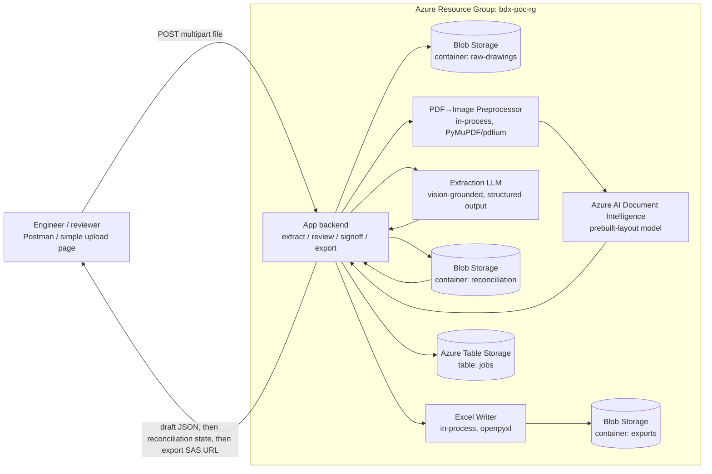

# Ballooned Drawing Extraction — POC Architecture

**Software Architecture & Design Specification — Proof of Concept**
Doc No. BDX-ARCH-POC-001 · Rev A — Draft · Date 2026-08-26

**Scope of this POC:** validate the single riskiest technical assumption behind the whole product — that Azure Document Intelligence + an LLM can reliably read balloon numbers, nominal dimensions, tolerances, and GD&T frames off real ballooned drawings — while still implementing a real (if simplified) version of the requirements doc's other non-negotiable: a human reconciliation gate before anything is exportable. **No real user auth, no multi-user concurrency, single drawing at a time.** Those remain deliberately deferred to the [Full production architecture](architecture-full.md); reconciliation itself is *not* deferred — see §1.4 trade-off #3 (updated) and §3.2.

**Assumptions carried from [ballooned-drawing-requirements.md](ballooned-drawing-requirements.md):** drawings arrive pre-ballooned, as PDF or ≥300 DPI raster image (§4, §6); Excel target is a configurable AS9102 Form 3–style template (§7 FR-17). **Assumptions specific to this architecture:** Commercial Azure (not Azure Government); single internal org, no multi-tenancy; infrastructure is disposable — torn down after the spike concludes, not hardened for production traffic.

> **Implementation note:** this baseline has moved twice since it was first written — the extraction LLM changed from Azure OpenAI to **Claude (Anthropic)**, and the compute host changed from an Azure Function App to a **single Flask app on Vercel** (Document Intelligence and Storage are still Azure services either way). This revision also updates §1.3, §1.4 trade-off #3, §2.1, §3.2, and §5 to describe the **reconciliation/sign-off gate that is now implemented** (`wabtec_poc/src/reconciliation.py`), a single-reviewer simplification of the two-human design in `architecture-full.md`. Prose elsewhere in this document that still says "Azure Function App" or "Azure OpenAI" reflects the original baseline and was not mechanically rewritten — treat `wabtec_poc/README.md` and the code as current for anything this note doesn't explicitly cover.

---

## 1. High-Level Design (HLD)

### 1.1 System Architecture Overview

**Pattern: single-purpose pipeline behind one Azure Function App** (not microservices, not even a full modular monolith). The POC's only job is to answer "can the AI pipeline extract this correctly?" — every other requirement (auth, review UI, reconciliation) is out of scope by design (see the Trade-offs below). One Function App hosts a handful of HTTP-triggered functions that execute a linear pipeline: **validate → convert → detect balloons → extract fields → write Excel → return result.** No orchestration engine, no message queue, no persistent application database.

### 1.2 Component Diagram



**External dependencies:** Azure AI Document Intelligence (layout/OCR), the extraction LLM (structured field extraction), Azure Blob Storage (file I/O, exports, and now the reconciliation record), Azure Table Storage (lightweight job log). No load balancer, no API gateway, no CDN needed at POC traffic levels regardless of host. (Node labels here were generalized rather than mechanically updated for every past provider/host change — see the Implementation note above.)

### 1.3 Data Flow — "Extract, then reconcile, then export"

**Extraction (produces a draft, not an export):**

1. User `POST`s a PDF/image to `/api/drawings/extract` with the API key.
2. The app validates file type and page count/DPI; rejects with `400` if below threshold (mirrors requirement FR-03).
3. File is written to `raw-drawings/{jobId}/source.pdf`; a job row is written to Table Storage with `status=Processing`.
4. Each page is rasterized to a high-resolution PNG in-process.
5. Each page image is sent to **Azure AI Document Intelligence** (`prebuilt-layout`) to extract text lines, tables, and bounding boxes — this gives every candidate balloon number and dimension string a page coordinate.
6. The Document Intelligence output (text + coordinates) **plus the page image itself** is sent to the **extraction LLM** with a structured-output schema asking it to: identify every balloon, and for each, return `{balloonNumber, nominalValue, unit, toleranceType, upperTol, lowerTol, gdt: {symbol, value, modifiers, datums}, confidence}`.
7. The app reconciles the model's balloon list against the raw balloon-shape count Document Intelligence detected (circles/ellipses in the layout output) and flags any mismatch in the response (not blocked — this is a POC, mismatches are *data*, not failures — see FR-10).
8. **A reconciliation record is seeded**, one entry per detected balloon, every entry `pending` (`wabtec_poc/src/reconciliation.py::ReconciliationService.start`). This is the new step: extraction used to stop here and generate the Excel immediately; it no longer does.
9. The app returns the draft JSON result inline (`export_url` is always `null` on this response) plus a `reconciliation` summary (counts, `readyForSignoff`, `signedOff`). Job row updated to `status=Complete` — meaning *extraction* complete, not *reconciled*.

**Reconciliation (the quality-check gate — requirements.md's "ensure 100% data accuracy" item):**

10. For each balloon, a reviewer calls `POST /api/drawings/{jobId}/balloons/{page}/{balloonNumber}/review` with one of `confirm` / `correct` (supplying a replacement value) / `cannot_determine` (supplying a reason). The reviewer's declared identity must differ from whoever submitted the drawing, or the app returns `403` (segregation of duties — FR-22, self-declared identity, not authenticated; see §3.3).
11. Once every balloon is `reconciled`, `POST /api/drawings/{jobId}/signoff` locks the record: `signed_off=true`, signer identity and timestamp stamped. Any balloon still `pending`/`cannot_determine` makes this `409` with the exact list of what's open (FR-24).
12. Once signed off, no further review calls are accepted on that job — the record is frozen (an addition beyond the original requirements text, made once it became clear an unlocked record could otherwise drift after sign-off).

**Export (only reachable after sign-off):**

13. `POST /api/drawings/{jobId}/export` reads the reconciled values (reviewer corrections win over the model's original output, confidence stamped to 1.0 as human-verified — FR-19), generates the Excel via the configured template, writes it to `exports/{jobId}/characteristics.xlsx`, and returns a short-lived SAS URL. Called before sign-off, this is `409` with the open-balloon list (FR-18).

### 1.4 Architectural Trade-offs

| # | Decision | Chosen because | Sacrificed |
|---|---|---|---|
| 1 | **Single Function App, no microservices** | Fastest path to a testable pipeline; one deployable, one log stream, trivial to iterate on prompts. | Service isolation, independent scaling, and the module boundaries the Full architecture will need — this code is expected to be substantially rewritten, not grown. |
| 2 | **Blob + Table Storage, no relational database** | Zero schema migrations, zero ops, matches the POC's single-user/single-job-at-a-time usage. | Queryability (no "show me all jobs from this week with confidence < 80%" without scanning), no relational integrity, no reconciliation workflow state machine. |
| 3 | **A real (single-reviewer) reconciliation/sign-off gate, but still no user auth** | *Superseded from the original baseline, which deferred reconciliation entirely.* Reconciliation was added because "isolate extraction accuracy from every other concern" turned out to make the POC unable to demonstrate the requirements doc's actual headline guarantee at all — a spike that can't be trusted for a real FAI/PPAP submission wasn't answering the question stakeholders cared about. Auth remains deferred: the gate's reviewer/signer identity is a self-declared string, not an authenticated account (see §3.3). | The full two-human-reviewer design in `architecture-full.md` (analyst confirms, independent reviewer confirms, disagreements get a third resolution step) — this POC has one human review pass over the model's output, so "discrepancy" means model-vs-human, not human-vs-human. |
| 4 | **Synchronous request/response, no queue** | Simplest to test with Postman; POC drawings are processed one at a time by one user. | Resilience and throughput — a Premium Function plan's ~230s timeout caps how large/complex a drawing can be processed in one call; this does not survive to batch volumes (Full architecture NFR: 200 drawings/package). |

---

## 2. Low-Level Design (LLD)

### 2.1 Core Modules & Classes

| Module | Responsibility |
|---|---|
| `UploadHandler` | HTTP trigger entry point; validates content-type/size, generates `jobId`, writes source blob, creates job record. |
| `DrawingPreprocessor` | Converts PDF pages to raster images at a controlled DPI; rejects pages below the quality floor (FR-03). |
| `BalloonDetector` | Calls Document Intelligence layout, isolates enclosed/circled numeric tokens as balloon candidates, returns `{number, boundingBox}[]`. |
| `ExtractionOrchestrator` | Builds the Azure OpenAI request (image + DI text layer + JSON schema), invokes the model, validates the returned JSON against the schema. |
| `ToleranceNormalizer` | Post-processes raw extracted tolerance strings into a normalized `{nominal, upper, lower, unit}` shape regardless of source notation (±, limit, unilateral). |
| `ExcelWriter` | Maps normalized field objects onto the configured template's column layout; writes the `.xlsx` — now only invoked from the export endpoint, after sign-off, never from the extraction call itself. |
| `JobStore` | Thin wrapper over Table Storage for job status read/write. |
| `ReconciliationService` | The state machine behind the reconciliation gate: seeds a `pending` record per balloon on extraction, applies `confirm`/`correct`/`cannot_determine` reviews (enforcing segregation of duties and, once signed off, refusing further changes), and gates sign-off/export on 100% of balloons being `reconciled`. |
| `ReconciliationStore` | One JSON blob per job (`reconciliation/{jobId}.json`) — the reconciliation record round-trips through the same pydantic models it's built from, so there's no separate schema to keep in sync; not a relational store, same rationale as `JobStore`'s. |

### 2.2 Design Patterns

- **Pipeline pattern** — the five processing stages (validate → preprocess → detect → extract → export) are composed as an ordered list of stages with a uniform `execute(context)` signature, so stages can be reordered/swapped without touching the HTTP trigger.
- **Strategy pattern** — `ExtractionOrchestrator` takes an `IExtractionStrategy`; the POC ships one strategy (`VisionGroundedExtractionStrategy`, DI text + image → GPT-4o), but the interface exists so a text-only or Document-Intelligence-custom-model strategy can be A/B tested without changing callers.
- **Retry with exponential backoff** — wraps both the Document Intelligence and Azure OpenAI SDK calls (Polly `AsyncRetryPolicy` / `tenacity` in Python) for `429`/`503` responses; 3 attempts, base 2s, jittered.
- **Adapter pattern** — Azure SDK clients are wrapped behind small interfaces (`IDocumentAnalysisClient`, `IChatCompletionClient`) purely so unit tests can substitute fakes; no other abstraction over them.

### 2.3 Error Handling & Edge Cases

| Condition | Handling |
|---|---|
| Unsupported file type / corrupt file | `400 Bad Request` with a specific reason; no job created. |
| Page below DPI/quality threshold | `422 Unprocessable Entity`; identifies which page(s) failed and why (mirrors FR-03). |
| Document Intelligence timeout or 5xx after retries | Job marked `status=ExtractionFailed`, reason recorded; Function returns `502` with the underlying error class (not the raw Azure error text). |
| Azure OpenAI returns malformed/non-schema-conforming JSON | One repair attempt (re-prompt with the validation error appended); if it fails twice, that balloon is emitted with `confidence=0` and `extractionError` set rather than dropped — every detected balloon still gets a row. |
| Azure OpenAI content filter trips on a drawing image | Logged, balloon flagged `blocked=true`; processing continues for the rest of the page rather than failing the whole job. |
| Balloon count mismatch (DI shape detection vs. AI-identified balloons) | Not an error — included in the response as `balloonCountMismatch: {detected, extracted}` so the operator can see it directly; this signal is exactly what the POC exists to measure. |
| Function execution time approaching plan limit | Preprocessing caps page count per request (configurable, default 10 pages) and returns `413` above that, rather than timing out mid-run. |

---

## 3. API Specification

### 3.1 Interface Protocol

**REST/HTTP over Azure Functions HTTP triggers.** No GraphQL, gRPC, or WebSockets — a POC with one caller (a tester and Postman/a minimal upload page) has no client-diversity or subscription requirement that would justify anything beyond plain synchronous REST.

### 3.2 Endpoints

#### `POST /api/drawings/extract`

Uploads and extracts one drawing synchronously. **Produces a draft, not a deliverable** — see §1.3.

- **Auth:** shared-secret header (`x-functions-key` on the Azure Functions build; `x-api-key` on the current Vercel build). **Not a production auth mechanism** — see Full architecture §3.3.
- **Request:** `multipart/form-data`
  | Field | Type | Notes |
  |---|---|---|
  | `file` | binary | PDF or PNG/JPEG/TIFF, ≤ 25 MB |
  | `templateId` | string (optional) | Defaults to `as9102-form3` |
  | `submittedBy` | string (optional) | Self-declared identity, recorded so the reconciliation gate can enforce segregation of duties (§3.2 below) |

- **Response `200 OK`:**
```json
{
  "jobId": "b3f1c9e2-...",
  "drawingNumber": "DWG-10245",
  "revision": "C",
  "balloonCountDetected": 47,
  "balloonCountExtracted": 45,
  "balloonCountMismatch": true,
  "balloons": [
    {
      "balloonNumber": 12,
      "page": 1,
      "boundingBox": [0.41, 0.22, 0.46, 0.27],
      "nominalValue": 25.4,
      "unit": "mm",
      "toleranceType": "bilateral",
      "upperTol": 0.05,
      "lowerTol": -0.05,
      "gdt": null,
      "confidence": 0.94
    },
    {
      "balloonNumber": 13,
      "page": 1,
      "nominalValue": null,
      "gdt": {
        "symbol": "position",
        "value": 0.1,
        "modifiers": ["MMC"],
        "datums": ["A", "B", "C"]
      },
      "confidence": 0.81
    }
  ],
  "exportUrl": null,
  "reconciliation": {
    "totalBalloons": 47,
    "pending": 47,
    "reconciled": 0,
    "cannotDetermine": 0,
    "percentComplete": 0,
    "readyForSignoff": false,
    "signedOff": false
  }
}
```

`exportUrl` is always `null` on this response now — see §1.3.

- **Status codes:** `200` success · `400` bad file · `422` quality threshold not met · `413` too many pages · `502` upstream AI service failure after retries.

#### `GET /api/drawings/{jobId}`

Re-fetches a previously computed job record (Table Storage lookup; no re-processing).

- **Response `200 OK`:** the job record (counts, status, timestamps) — not the balloon list; that's `GET .../reconciliation` below. **`404`** if `jobId` unknown or its blob retention window (see §4.3) has expired.

#### `GET /api/drawings/{jobId}/reconciliation`

Full reconciliation state, every balloon — what a review UI loads to render the side-by-side view (FR-21).

- **Response `200 OK`:** the reconciliation record — `submittedBy`, `signedOff`/`signedOffBy`/`signedOffAt`, and per balloon: `status` (`pending`/`reconciled`/`cannotDetermine`), the immutable `extracted` value, the `reviewed` value if any, `discrepancy`, `reviewerId`, `reviewedAt`, `notes`.

#### `POST /api/drawings/{jobId}/balloons/{page}/{balloonNumber}/review`

Confirms, corrects, or flags one balloon. Keyed on `(page, balloonNumber)`, not balloon number alone — numbering can restart per page.

- **Request:** `{ "reviewerId": "...", "action": "confirm" | "correct" | "cannot_determine", "correctedValue"?: {...}, "notes"?: "..." }`. `correctedValue` is required for `correct`; `notes` is required for `cannot_determine` (FR-25).
- **Status codes:** `200` updated · `400` malformed action/missing required field, or the drawing is already signed off · `403` `reviewerId` matches the job's `submittedBy` (FR-22) · `404` unknown job or balloon.

#### `POST /api/drawings/{jobId}/signoff`

Locks the record once every balloon is `reconciled` (FR-24, FR-26).

- **Request:** `{ "signerId": "..." }`.
- **Status codes:** `200` signed off · `403` `signerId` matches `submittedBy` · `409` one or more balloons still open — response includes the exact `openBalloons: [{page, balloonNumber}]` list (FR-24's completion indicator, surfaced as an error rather than a separate polled endpoint).

#### `POST /api/drawings/{jobId}/export`

Only reachable after sign-off (FR-18).

- **Response `200 OK`:** `{ "jobId": "...", "exportUrl": "..." }` — generated from the reconciled values (reviewer corrections win over the model's original output), confidence stamped to 1.0.
- **Status codes:** `409` not yet signed off, same `openBalloons` shape as sign-off's 409.

### 3.3 Authentication & Authorization

None beyond the shared-secret header. There is exactly one implicit role (tester/operator) at the *app-access* layer. The reconciliation gate (above) adds a second, orthogonal and equally unauthenticated layer on top: `reviewerId`/`signerId`/`submittedBy` are self-declared strings the app compares to each other for segregation of duties, not identities it verifies — seeing `403` proves two different names were typed in, not that two different people did the work. Both gaps are explicitly flagged, not overlooked — see the Full architecture's Entra ID model.

---

## 4. Data Specification

### 4.1 Storage Overview (no relational database in the POC)

| Store | Purpose |
|---|---|
| **Blob container `raw-drawings`** | Original uploaded files, keyed by `{jobId}/source.pdf`. |
| **Blob container `exports`** | Generated `.xlsx` files, keyed by `{jobId}/characteristics.xlsx` — only written after sign-off now, not on every extraction. |
| **Blob container `reconciliation`** | One JSON blob per job, keyed by `{jobId}.json` — the full reconciliation record (§2.1's `ReconciliationStore`); this is the new addition. |
| **Azure Table Storage `jobs`** | One row per job: `PartitionKey` = upload date, `RowKey` = `jobId`, columns: `fileName, status, drawingNumber, revision, balloonCountDetected, balloonCountExtracted, avgConfidence, createdAt, completedAt, errorReason`. |

### 4.2 Why Blob + Table instead of a database

A relational store buys queryability and integrity the POC doesn't need yet — there is no reconciliation state machine, no cross-drawing reporting, no concurrent writers. Table Storage gives a queryable job log at effectively zero operational cost; Blob Storage is the natural fit for the actual payloads (PDFs, images, spreadsheets), which don't belong in a database row regardless of architecture stage.

### 4.3 Caching & Lifecycle

- **Caching:** none. Every call to Document Intelligence/Azure OpenAI is live; POC volumes don't justify a cache layer, and caching AI extraction results would risk masking non-determinism the POC is specifically trying to measure.
- **Retention:** a Blob lifecycle management policy deletes everything in `raw-drawings` and `exports` **30 days** after last-modified. This is throwaway infrastructure processing what may be proprietary drawings — short retention is a safety default, not a product decision (compare to the Full architecture's compliance-driven retention policy).
- **Teardown:** the entire resource group is expected to be deleted once the extraction-accuracy question is answered, POC or not.

---

## 5. What This POC Does *Not* Answer

Explicitly out of scope, and not to be inferred from a successful spike: multi-user concurrency, real authentication/authorization (both at the app-access layer and for reconciliation identity — see §3.3), batch throughput at production volume, cost-at-scale, export-control/data-residency handling, and Excel template configurability beyond one hard-coded layout. All of these are addressed in [architecture-full.md](architecture-full.md).

**No longer on this list, since the last revision:** the reconciliation/sign-off workflow itself — it's implemented (§1.3, §3.2), just in a deliberately simplified single-reviewer form. What's *still* not answered about it specifically: the full two-human-reviewer/disagreement-resolution design (§1.4 trade-off #3), and a "cannot determine" balloon actually routing to a drawing owner (FR-25 says "route to"; this build records the flag and stops there — nothing paged, emailed, or reassigned).
